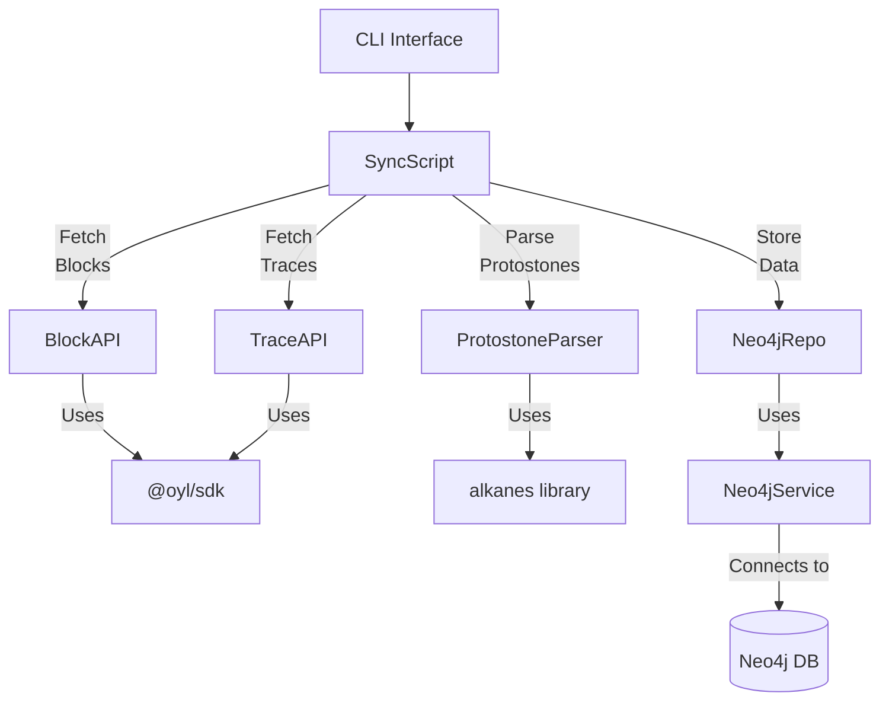
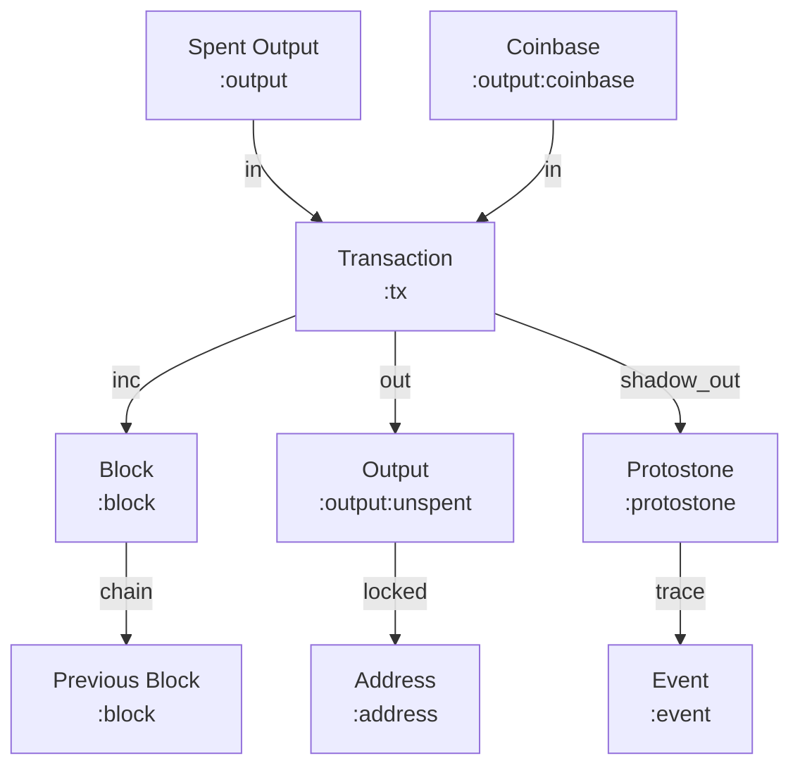
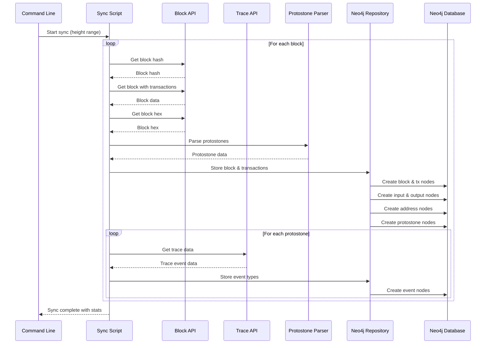

# Protostone Processor

A robust system for extracting Alkanes protostones from Bitcoin blocks and efficiently syncing them to Neo4j, including full blockchain data, transaction context, UTXO tracking, and trace event analysis.

## Overview

This project connects the Bitcoin blockchain to Alkanes protocol activity through a high-performance Neo4j graph database. It extracts and processes:

- Bitcoin blocks, transactions, inputs, and outputs
- Alkanes protostones embedded in Bitcoin transactions
- Trace event types associated with each protostone

The result is a comprehensive graph model enabling powerful analytics and protocol research.

## Architecture

The system follows a clean, modular architecture:



## Graph Model

The database uses a clean, analytics-friendly graph model:



## Features

- **Blockchain Data Processing**: Full Bitcoin protocol support including coinbase and UTXO tracking
- **Protostone Extraction**: Identifies and extracts Alkanes protostones from transaction data
- **Trace Event Integration**: Fetches and stores trace event types for each protostone
- **Clean Graph Model**: Efficient Neo4j representation with proper relationships and constraints
- **Command-Line Interface**: Simple tools for syncing, viewing stats, and managing the database
- **Analytics Support**: Comprehensive Cypher queries for blockchain and protostone analysis

## Prerequisites

- Node.js 16+
- Neo4j 4.4+ (with APOC plugin recommended)
- Access to OYL Bitcoin API

## Installation

```bash
# Clone the repository
git clone https://github.com/yourusername/protostone-processor.git
cd protostone-processor

# Install dependencies
npm install

# Configure environment
cp .env.example .env
# Edit .env with your Neo4j and API credentials
```

## Configuration

Create a `.env` file with:

```
# Neo4j Connection
NEO4J_URI=bolt://localhost:7687
NEO4J_USER=neo4j
NEO4J_PASSWORD=password

# OYL API Configuration
OYLNET_API_URL=https://oylnet.oyl.gg/v2/regtest
```

## Usage

### Command Line Interface

```bash
# Show available commands
npm run cli

# Sync from block 0 to 1000
npm run cli sync --start 0 --end 1000 --batch 10

# Show database statistics
npm run cli stats

# Clear the database (with confirmation flag)
npm run cli clear --confirm
```

### Direct Script Usage

```bash
# Sync blocks 0-1000 in batches of 10
npx ts-node src/scripts/neo4j-sync.ts 0 1000 10
```

## Project Structure

```
protostone-processor/
├── cypherQueries/           # Neo4j Cypher query examples
│   ├── AI/                  # Analytics-focused queries
│   └── SAMPLES/             # Sample/example queries
├── memory-bank/             # Project documentation
│   ├── projectbrief.md      # High-level project overview
│   ├── productContext.md    # Business context and requirements
│   ├── techContext.md       # Technical specifications
│   ├── systemPatterns.md    # Architectural patterns
│   ├── activeContext.md     # Current state and next steps
│   └── progress.md          # Implementation status
├── src/
│   ├── api/                 # External API clients
│   │   ├── blockApi.ts      # Bitcoin block data access
│   │   ├── traceApi.ts      # Protostone trace data access
│   │   └── config.ts        # API configuration
│   ├── db/                  # Database layer
│   │   ├── neo4j-repository.ts  # Core database operations
│   │   └── neo4j-service.ts     # Connection management
│   ├── parsers/             # Data parsers
│   │   └── protostone.ts    # Protostone extraction
│   ├── scripts/             # Executable scripts
│   │   └── neo4j-sync.ts    # Primary sync script
│   ├── types/               # TypeScript definitions
│   │   ├── block.ts         # Block data structures
│   │   └── protostone.ts    # Protostone types
│   ├── utils/               # Utility functions
│   │   └── logger.ts        # Logging utility
│   └── cli.ts               # Command-line interface
├── .env                     # Environment configuration
└── package.json             # Project metadata and dependencies
```

## Graph Database Structure

The Neo4j graph model represents:

- **Blocks**: Connected in a chain via `:chain` relationships
- **Transactions**: Linked to blocks via `:inc` relationships
- **Outputs**: Connected to transactions via `:out` relationships, labeled `:unspent` when created
- **Inputs**: Spent outputs connected via `:in` relationships to spending transactions
- **Addresses**: Connected to outputs via `:locked` relationships
- **Protostones**: Special nodes connected to transactions via `:shadow_out` relationships
- **Events**: Trace event type nodes connected to protostones via `:trace` relationships

### Data Flows



## Analytics Capabilities

The project includes powerful Cypher queries for analytics:

- Transaction graph analysis
- UTXO distribution by address
- Protostone frequency and patterns
- Event type distribution and co-occurrence
- Temporal analysis of blockchain activity

## Development

To extend or modify the project:

1. **Add new API integrations**: Extend the API clients in `src/api/`
2. **Modify the graph model**: Update the Neo4j repository methods in `src/db/neo4j-repository.ts`
3. **Create new analytics**: Add Cypher queries to `cypherQueries/`
4. **Enhance CLI**: Add new commands to `src/cli.ts`

## License

This project is licensed under the MIT License - see the LICENSE file for details.
