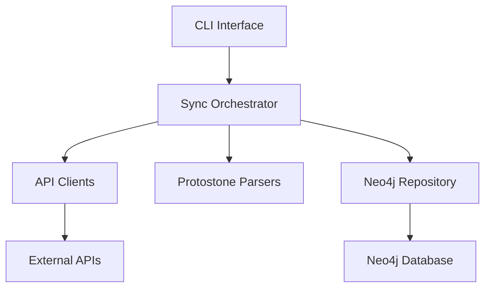

# System Patterns

## Architecture Overview

The system follows a clear layered architecture:

## Core Design Patterns

### 1. Repository Pattern
The `Neo4jRepository` class encapsulates all graph database operations, providing a clean interface for storing and retrieving data. It follows the repository pattern by:
- Abstracting database operations behind a domain-specific interface
- Handling data mapping between application models and database structures
- Centralizing database access logic in one place

### 2. Service-based Connectivity
The `Neo4jService` implements a singleton pattern to manage database connections efficiently:
- Provides a single connection point to Neo4j
- Manages session lifecycle
- Handles connection pooling

### 3. Command Pattern (CLI)
The CLI implementation uses the Commander.js library to implement the command pattern:
- Each command is encapsulated in its own action handler
- Commands have clear interfaces with defined options
- Commands are composable and follow a consistent pattern

### 4. Data Transformation Pipeline
The sync process follows a clear pipeline pattern:
1. Fetch block data from API
2. Extract transactions
3. Parse protostones
4. Fetch trace data
5. Transform into graph model
6. Store in Neo4j

### 5. Shadow Output Model
Protostones are modeled as "shadow outputs" of transactions:
- Connected to their parent transaction via `:shadow_out` relationship
- Use vout values beyond the real outputs (vout > tx.vout.length)
- Maintain consistent indexing with the Bitcoin/Alkanes protocol

### 6. Event Type Extraction
For trace events, we only store the event type as a separate node:
- Each protostone connects to multiple event nodes via `:trace` relationship
- Event nodes store only the essential type information
- Avoids Neo4j type errors from complex nested objects

## Error Handling Patterns

1. **Layer-specific Error Handling**:
   - API errors are handled in the API layer
   - Parse errors are handled in the parser layer
   - Database errors are handled in the repository layer

2. **Graceful Degradation**:
   - Missing outputs are handled by creating placeholders
   - Missing trace data doesn't block block processing

3. **Transaction Boundaries**:
   - Each block is processed as a logical unit
   - Errors in one block don't affect others

## Optimization Patterns

1. **Batch Processing**:
   - Blocks are processed in configurable batches
   - Progress is reported after each batch

2. **Skip Existing**:
   - Already processed blocks can be skipped for faster resyncs

3. **Efficient Neo4j Operations**:
   - Proper indexing on key node properties
   - Efficient Cypher queries with parameterization
   - Careful management of Neo4j sessions

## Data Model Patterns

1. **Chain Structure**:
   - Blocks form a chain via `:chain` relationships
   - Heights are derived from the chain structure

2. **UTXO Management**:
   - Outputs have the `:unspent` label when created
   - The label is removed when the output is spent

3. **Address Linking**:
   - Outputs are linked to Bitcoin addresses via `:locked` relationships
   - Allows for address-based UTXO tracking
